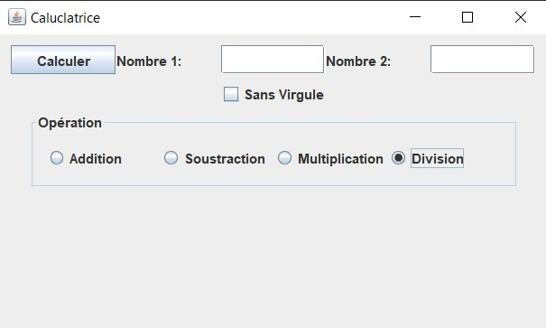

# Calculatrice Java

Ce projet est une calculatrice simple implémentée en Java à l'aide de l'interface graphique Swing.

## Fonctionnalités

- Opérations de base : Addition, Soustraction, Multiplication, Division
- Possibilité de spécifier si les résultats doivent être affichés sans virgule

## Comment exécuter le programme

1. Assurez-vous que vous avez Java installé sur votre machine.
2. Clonez le dépôt : `git remote add origin https://github.com/amddah/Calculatrice_Java.git`
3. Naviguez vers le répertoire du projet : `cd Calculatrice_Java`
4. Compilez le programme : `javac Calculatrice.java`
5. Exécutez le programme : `java Calculatrice`

## Captures d'écran

##Note additionnelle
Un fichier .jar a été ajouté au dépôt pour une exécution plus simple.
Vous pouvez exécuter le fichier .jar fourni directement avec la commande : java -jar Calculatrice.jar.
## Licence

Ce projet est sous licence MIT - voir le fichier [LICENSE.md](LICENSE.md) pour plus de détails.
